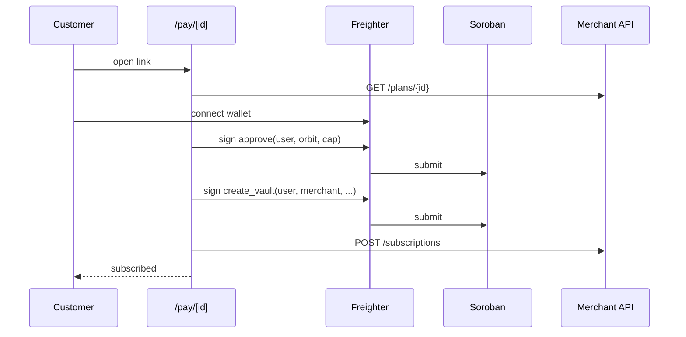

Every plan gets a hosted checkout page. Share the link anywhere: in a DM, a bio, an email or a button on your site.

```text
https://orbit-lemon-mu.vercel.app/pay/{plan_id}
```

## Flow



<Steps>
  <Step title="Create a plan">
    In the dashboard, open **Subscription Plans** and create one, or call [`POST /plans`](/api-reference/overview). Copy its `id`.
  </Step>

  <Step title="Share the link">
    Paste `/pay/{plan_id}` into your site or messages. The **Payment Links** module in the dashboard tracks views and conversions.
  </Step>

  <Step title="Pull on schedule">
    Once the customer subscribes, they appear under **Subscribers**. Pull each cycle from the dashboard, or automate it. See [Billing cycles](/guides/subscriptions/billing-cycles).
  </Step>
</Steps>

<Note>
  The hosted page is in **preview**. It connects Freighter (or falls back to a demo wallet) and records the subscription, but it does not yet submit the `approve` and `create_vault` transactions. Until it does, run the handshake with the code in [Checkout widget](/guides/checkout/widget#signing-the-handshake-yourself).
</Note>

<Warning>
  Only treat a subscription as active once the `create_vault` transaction is confirmed on the ledger. A redirect back to your site is not proof of payment.
</Warning>
